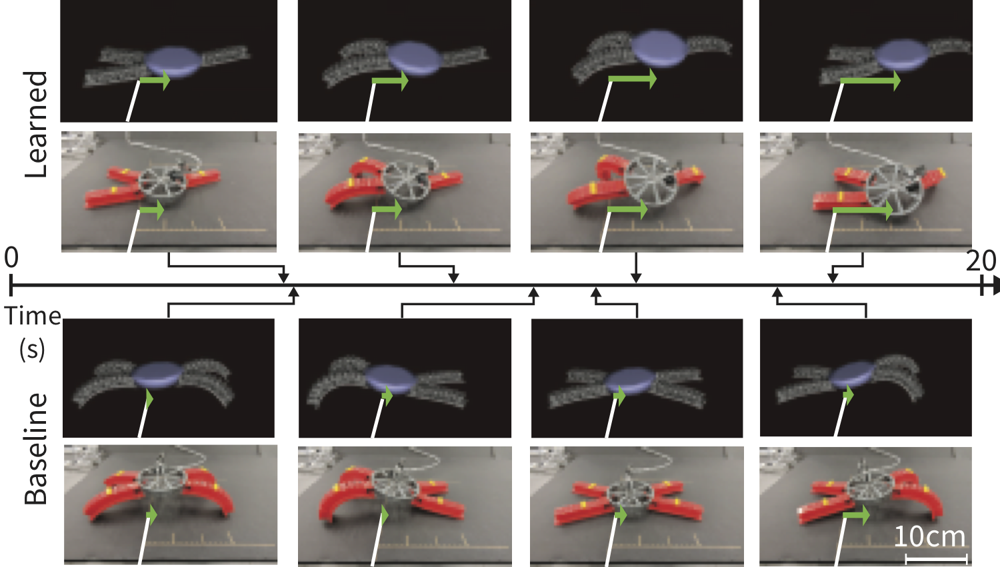

# Soft Robots Learn to Crawl: Jointly Optimizing Design and Control with Sim-to-Real Transfer

This repository contains code for the paper [Soft Robots Learn to Crawl: Jointly Optimizing Design and Control with Sim-to-Real Transfer](https://arxiv.org/abs/2202.04575).

It provides the code for model order reduction, co-optimiztion of design and control, and testing the optimized design-control pairs in simulation.

## Installation

Our code relies on [Docker](https://www.docker.com/get-started) and the docker wrapper [cpk](https://github.com/afdaniele/cpk) to manage its dependencies.

To use this codebase, follow these installation steps:

1. Intstall Docker.
2. Install cpk: `python -m pip install cpk`
3. Clone this repository.
4. From the top level directory, run `cpk build` to build the docker container.

Additionally, this codebase uses [Weights and Biases](https://wandb.ai/site) for logging and visualization, which is free to use for academics.
Running a training job will prompt you to login, create an account, or not visualize the results.
If you wish to avoid manual logins, place your wandb `.netrc` file in the `assets/wandb_info` directory.

If you only want to visiualize the pretrained model, then creating a wandb account is not required.

## Testing the Learned and Baseline Models

We provide code to visualize a pretrained model and our baseline.

- To visualize the pretrained model, run: `cpk run -M -f -X -L viz_pretrained`
- To visualize the baseline, run: `cpk run -M -f -X -L viz_baseline`

## Running a Co-optimization Experiment

The training code is run in two pieces: a training script and an evaluation script which runs concurrently.
Training is CPU intensive. We ran this experiment with 96 paralell SOFA environments for training on a 32-core [AMD EPYC 7502](https://www.amd.com/en/products/cpu/amd-epyc-7502).
You can adjust the cpu load by editing the config file `configs/coopt.yaml`.

- To launch a training job, run: `cpk run -M -f -n train -L train`
- To launch the eval job, run: `cpk run -M -f -n eval -L eval`

The eval job will search for checkpoints in the `exps` directory and generate videos and evaluation performance.
All logs and videos will be visible on wandb in a newly created evolving-soft-robots project.

### Running Experiments with Domain Randomization

- To launch the training job with friction randomization, edit the config file `configs/coopt.yaml`, set `sofa_make_env.friction_coef` value to `@domainRND()`
- To change the range of friction to be randomized, edit the `@domainRND()` function in `package/python3/make_env.py` to fit your need.

## Performing Model Order Reduction

This repository contains the reduced order models used in this paper, as well as code to create your own reductions.

- To launch a reduction, run: `python scripts/launch_reduction_block.py`

This will launch a grid search over the two tolerances for the reduction.
The reduction takes several hours to complete and requires large amount of RAM (~200GB).
